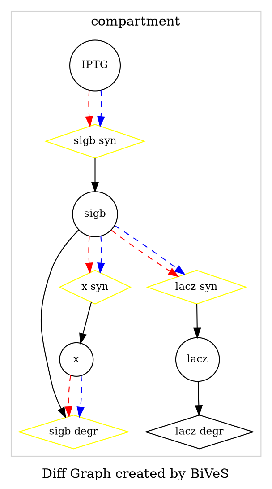

Graphs encoded in DOT 
======================

* e.g. to convert them to static images using GraphViz
* see also [DOT](https://en.wikipedia.org/wiki/DOT_language)
* TODO: detailed description of the graph
* TODO: how to run graphviz (neato, dot etc.. differences? different examples)
* TODO: demo
* example Graph:

